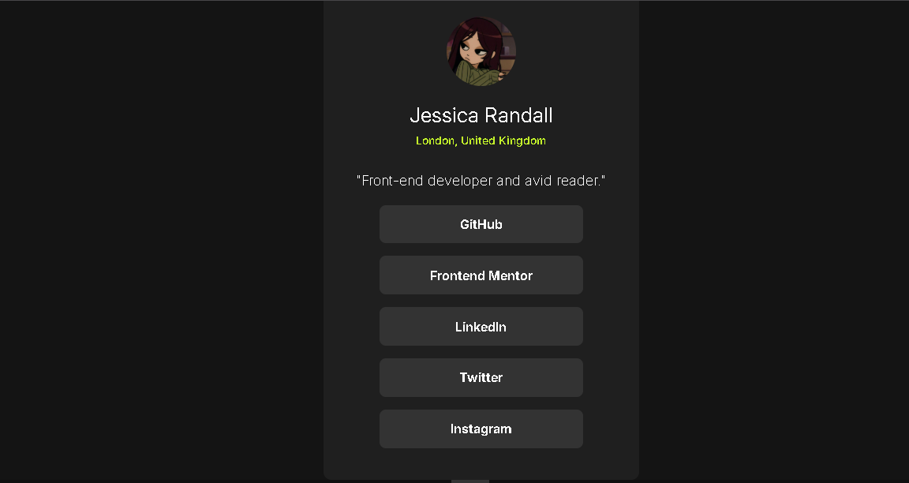

# 🔗 Social Media Links Profile : 

A clean and responsive social media links profile card built using **HTML and CSS**.

This project showcases a modern profile card UI where users can view profile information and access different social media platforms through interactive link buttons.

The project focuses on frontend layout design, responsive styling, typography, spacing, and creating polished UI components using pure HTML and CSS.

🔗 **Live Website:**  

## 📸 Preview

## ✨ What This Project Does

✅ Displays user profile information inside a centered card layout  

✅ Shows social media platform links using styled buttons  

✅ Creates a clean and modern dark-themed UI  

✅ Uses responsive design principles for different screen sizes  

✅ Demonstrates frontend component structuring using HTML & CSS  

✅ Focuses on spacing, alignment, and typography design  

## ⚡ Features

- 🔗 Social media profile card
  
- 🎨 Modern dark-themed UI
  
- 📱 Responsive design
  
- ✨ Clean typography and spacing
  
- 🧠 Structured card-based layout
  
- 👤 Profile image and bio section
  
- 🌐 Pure HTML & CSS implementation

## 🛠️ Tech Stack

- 🌐 HTML5
  
- 🎨 CSS3

## 💡 Concepts Practiced

This project helped me improve my understanding of:

- Responsive Web Design
  
- Flexbox Layouts
  
- Frontend UI Structuring
  
- CSS Styling Techniques
  
- Typography & Spacing
  
- Visual Hierarchy
  
- Component-Based Design

├── style.css
├── assets/
└── preview.jpg
